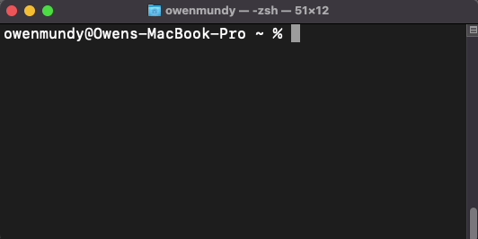

# dig333-devlog

#### Weeks: [1](#week-1) [2](#week-2) [3](#week-3) [4](#week-4) [5](#week-5) [6](#week-6) [7](#week-7) [8](#week-8) [9](#week-9) [10](#week-10) [11](#week-11) [12](#week-12) [13](#week-13) [14](#week-14) [15](#week-15)


<!--
BELOW IS A WEEKLY TEMPLATE. COPY/PASTE IT TO ADD A WEEK. SEE ASSIGNMENTS FOR DETAILS
https://docs.google.com/document/d/1PAoPz-3vDPFWS5q9RHRb-dC7T4earpFXJW8w6v9wfZ0/edit
-->


## Week 1

### Context

- Tom Igoe [Physicality and Conviviality](http://www.youtube.com/watch?v=fi4mN-Oicos) (15:17) talks about the origins of the ITP program and the Arduino.
- Quote: The ITP program emerged to give people more control over media and computing.
- Comment: It's great that the Arduino is still open source. I think that is a big reason why it is still successful. I love the idea of using mud to work PowerPoint!
- If high performance technology is accessible to everyone, then how do we ensure such electronics are not being used for harm?


### Experiment 1: [Learn Computing: The Command Line](https://omundy.github.io/learn-computing/slides/command-line.html)

I enjoyed learning to control my computer without using the GUI.



Here are some commands I learned

```bash
# write a string
echo Hello World!
# -> Hello World!

# put working directory
pwd
# -> /Users/owenmundy

# test the connection to a server
ping -c 5 davidson.edu
# -> PING davidson.edu (23.185.0.1): 56 data bytes
# -> 64 bytes from 23.185.0.1: icmp_seq=0 ttl=59 time=18.155 ms
# -> 64 bytes from 23.185.0.1: icmp_seq=1 ttl=59 time=25.619 ms
# -> ...
# -> --- davidson.edu ping statistics ---
# -> 5 packets transmitted, 5 packets received, 0.0% packet loss
# -> round-trip min/avg/max/stddev = 17.387/21.148/26.858/4.182 ms
```

Quiz Question: How can you autocomplete commands once you start typing?


## Week 2

### Context

- Summarize the article(s) in 3-4 sentences. Also include...
- Quote:
- Comment:
- Question:


### Experiments

<!-- List each Platt experiment / Monk recipe outcome, adding notes, photos, schematics, captions to show your work. -->

1. Name of the experiment
    1. Text, photos, etc.
    1. Describe the most important thing you learned (to share in class)
    1. Write a quiz question (which we will discuss in class)
