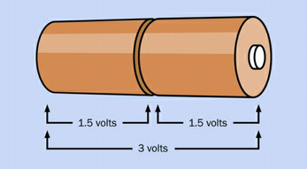
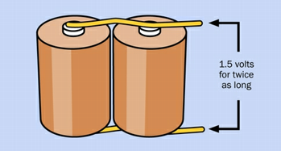

[<](README.md)


# Week 02


## Articles

Sanjay Sarma, [The Internet of Things: Roadmap to a Connected World](https://www.technologyreview.com/s/601013/the-internet-of-things-roadmap-to-a-connected-world/) (2016)
- Sarma writes about “The Internet of Things (IoT)—a sophisticated network of objects embedded with electronic systems that enable them to collect and exchange data”
- “The rapidly increasing number of interconnected devices and systems today brings both benefits and concerns.” - Although he doesn't list many concerns...
- “What if every vehicle, home appliance, heating system and light switch were connected to the Internet?” - This sounds awful to me. 😱

Internet of Shit, [The Internet of Things has a dirty little secret: it's not really yours](https://www.theverge.com/circuitbreaker/2016/7/12/12159766/internet-of-things-iot-internet-of-shit-twitter) (2016)
- reliability: "dumb" devices just work. If the internet goes down, they still work. No upgrades needed.
- trendiness: e.g. Google might sell the Nest to a smaller company
- long term support: they should, as the author says, last longer than myspace was in vogue
- cost: The smaller company could cut support for old devices unless you upgrade your device or plan
- privacy: the new owner could monetize *you* by selling the information they have you?
- further monetization: They could make you look @ ads to use the thing.


## Experiments


### Platt 1: Taste the Power

#### Outcomes
- I learned how to use a multimeter to measure Ohms.

#### Comments & Variations
- No matter how hard I tried I couldn't convince my daughter to try the battery on the tongue.

#### Questions
- How many of you put your tongue on a 9V battery?


### Platt 2: Abuse a battery

#### Outcomes
- ⚠️ Don't destroy the battery
- I learned why the units for current are represented with an "I" (French origin "Intensity").

#### Comments & Variations
- I have heard my father, an electrician for GM, recite Ohm's Law many times but hadn't committed to manually performing the math in a long time. I like this book.

#### Questions
- "Does a battery have direct or alternating current?" (Mimi)


### Platt 3: Your First Circuit

#### Outcomes
- I learned how to use a multimeter to measure Ohms

#### Comments & Variations


<small>Daughter and I made a Frog. See the <a href="https://www.instagram.com/p/CZqCnmvJhOL/">video</a></small>

#### Questions
- "Why might we use a resistor in a circuit?" (Mimi)


### Platt 4: Variable Resistance

#### Outcomes
- A potentiometer works by having a wiper rub against a resistant material as it is turned
- Using a pot instead of a static resistor provides variable resistance which enables us to dim and brighten our LED

#### Comments & Variations
- Ohm's Law: R = V / I

#### Questions
- "How could we make the LED brighter with only changing one thing?" (Brady)


### Platt 5: Let's Make a Battery


#### Outcomes

I learned to define and describe the relationship between volts, current, and watts. Platt writes that, "the motion of an electron creates a wave of electromagnetic force", and this force can be measured, "wattage is a measurement of the rate at which work is done." (Platt, 38)

> One volt can be defined as the amount of pressure that you need to create a flow of 1 ampere, which does 1 watt of work. (Platt, 37)

So we can write

```bash
1 watt = 1 volt × 1 ampere #
1 volt = 1 watt / 1 ampere
```

The electrical units can all be anchored with observations of mass, time, and the charge on electrons.

```bash
1 watt = 1 joule / second
1 joule = 1 newton force acting through 1 meter
1 newton accelerates 1kg by 1m / sec each second
```

#### Comments & Variations

I also appreciated how Platt reinforced earlier information in new ways. For example, the relationship between current, potential, and force is described well by these batteries:

 

<small>Voltage adds up in series. The batteries on the left provide twice the voltage of one battery. Current (the amount of electrons flowing, and thus the work) doubled on the right, while the voltage stays the same.</small>

#### Questions
-


### Monk - Ch1 Setup and Management (1-25)


#### Outcomes
- Intro to the Raspberry Pi hardware, software, OSs, power, and a bit of configuration.

#### Comments & Variations
- I am constantly amazed at how fast things change around physical computing. NOOBS is no longer supported.

#### Questions
- Does anyone feel overwhelmed by the cookbook? I hope you are looking at this [doc](https://docs.google.com/document/d/1MDj8d0E016svtH8UVVtm0cNJesyUg2igiriTZw5aefk/edit#).
