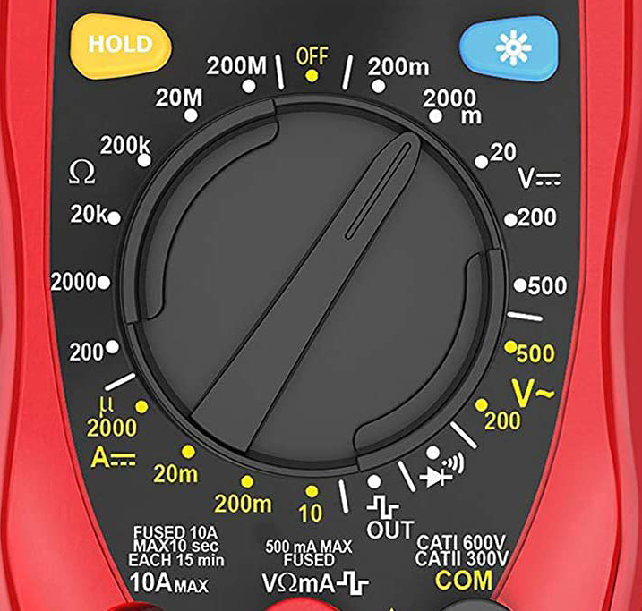
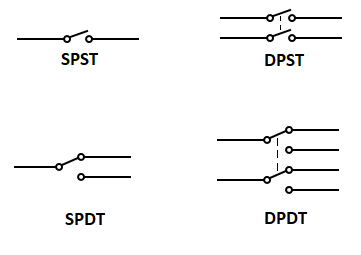
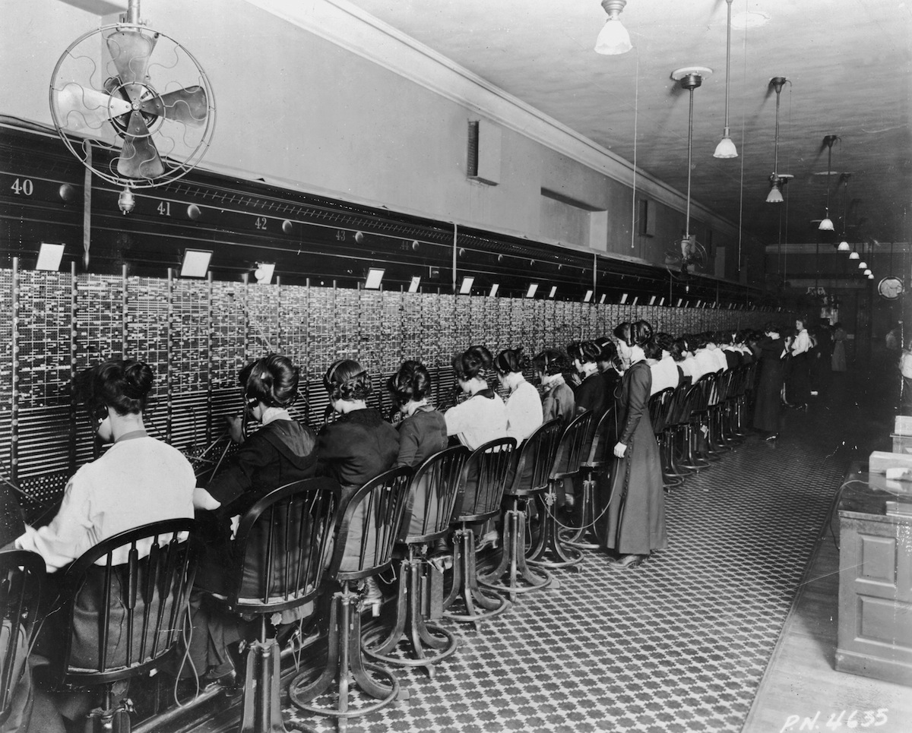

[<](README.md)

# Week 03

## Articles

Author, Article (year)
- Quotes:
- Comments:
- Questions:

## Experiments

### Platt 6: Very Simple Switching

#### Outcomes

- I learned how to check the continuity using a switch and a multimeter. The continuity test looks like a diode and "sound alert".

#### Comments & Variations

This table shows some of the different types of switches covered in this chapter:

Abbr. | Name | ON/OFF | Example
--- | --- | --- | ---
SPST (1P1T) | single-pole, single-throw switch | on-off | Light switches in your house. Only connect circuit in one direction.
DPST (2P1T) | double-pole, single-throw switch | on-off | To control a 240-volt appliance in your house
SPDT (1P2T) | single-pole, double-throw switch | on-on | A basic on/off toggle switch
DPDT (2P2T) | double-pole, double-throw switch | on-on | Toggle switch with two poles, often used in AC power or to control a DC motor
SPST (1P1T) | single-pole, single-throw pushbutton | off-(on) | A  "momentary" switch that is on only when held down, and flips back to off when released.

- **toggle**: the part of a switch that you flip with your finger
- **pole**: center terminal of a double-through (DT) switch
- **sparking**: when you make or break electrical contact

<small>Platt, Make: Electronics (p. 51)</small>

#### Questions
- Do you know where the term "audio jack" comes from? The inventor of the first electrical switch called it a "jack knife". The ubiquitous "jack switch" was used for many years in telephone operators, until it was replaced by relays (electrically operated switches) and finally, transistors.

[Goodbye to the Hello Girls: Automating the Telephone Exchange](https://www.sciencemuseum.org.uk/objects-and-stories/goodbye-hello-girls-automating-telephone-exchange) (2018)

### Platt 7: Investigating a Relay

#### Outcomes
-

#### Comments & Variations
-

#### Questions
-

### Platt 8: A Relay Oscillator

#### Outcomes
-

#### Comments & Variations
-

#### Questions
-

### Platt 9: Time and Capacitors

#### Outcomes
-

#### Comments & Variations
-

#### Questions
-

### Platt 10: Transistor Switching

#### Outcomes
-

#### Comments & Variations
-

#### Questions
-
